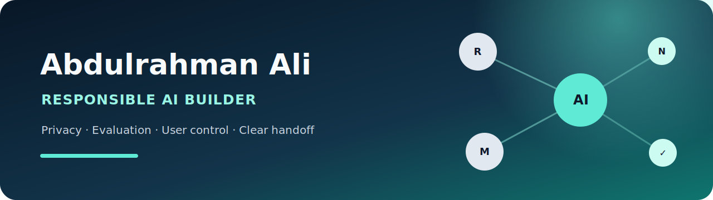

  

# Abdulrahman Ali

**Computer Science Student and Responsible AI Builder**

I build responsible AI tools from idea to tested application, with a focus on privacy, user control, evaluation, and clear handoff.

Explore the [public project portfolio](https://github.com/Mewzara/ai-project-portfolio) for the connected case studies and reviewer guidance.

## Featured projects

### [RadDraft CXR Research Showcase](https://github.com/Mewzara/raddraft-cxr-research-showcase)

A nonclinical research prototype exploring structured-output reliability for chest X-ray draft generation. The showcase emphasizes parser evaluation, evidence boundaries, and reproducible engineering fixtures—not medical accuracy or clinical use.

### [Mino AI Assistant Showcase](https://github.com/Mewzara/mino-ai-assistant-showcase)

A privacy-conscious assistant experience shaped around transparent memory controls, user-managed context, and a tested product workflow. The public-facing materials use only synthetic data.

### [Nura Reflection Assistant](https://github.com/Mewzara/nura-reflection-assistant)

A private-first reflection assistant with local data controls, evaluation coverage, and explicit safety boundaries. Nura supports reflection; it is not a therapist or substitute for professional care.

## How I work

I care about traceable evaluation, honest limitations, minimal data exposure, and documentation that lets another engineer review or continue the work. My [project portfolio](https://github.com/Mewzara/ai-project-portfolio) connects the case studies and reviewer guidance for these three projects.
